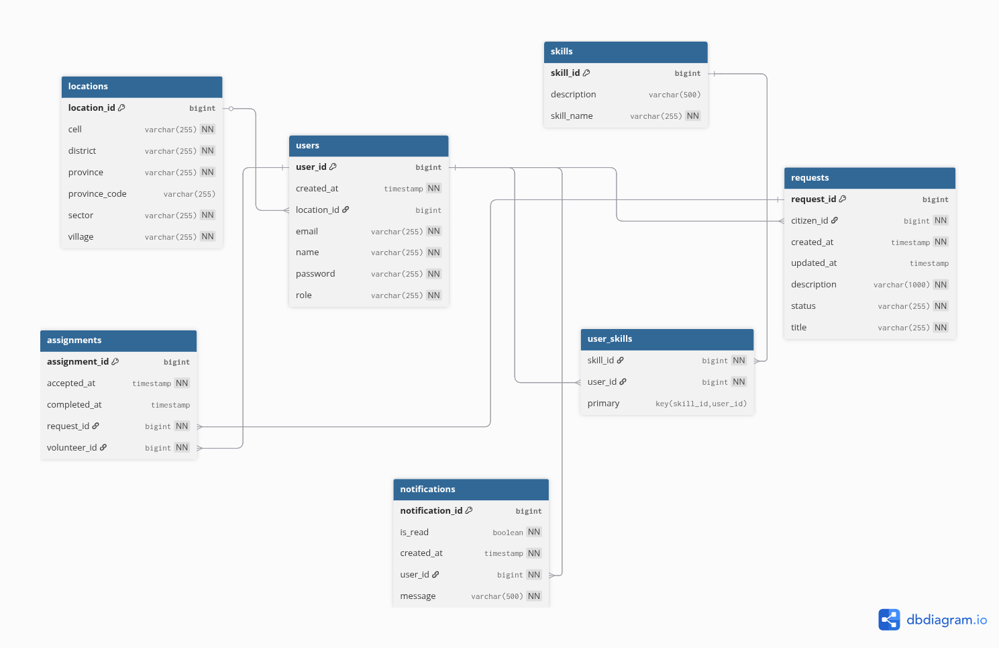
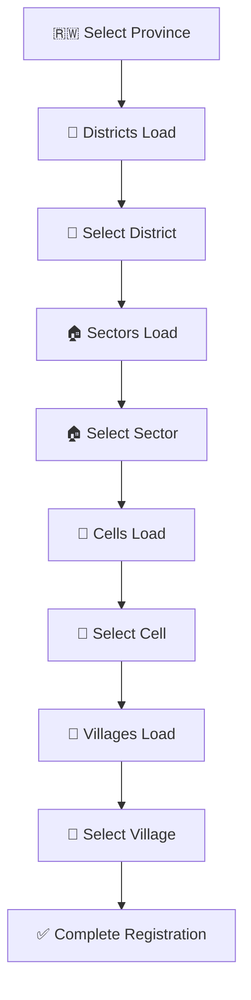

<div align="center">

# 🤝 Community Help Portal

<p align="center">
  
  
  
  
  
  
  
</p>

<p align="center">
  <strong>🌟 A comprehensive full-stack web platform connecting citizens in need with volunteers for community assistance 🌟</strong>
</p>

<p align="center">
  <strong>✅ Production Ready | 🚀 Cloud Deployed | 🔒 Secure | 📱 Responsive</strong>
</p>

</div>

---

## 📋 Overview

The **Community Help Portal** is a Spring Boot web application that bridges the gap between citizens seeking assistance and volunteers ready to help. Whether it's grocery delivery, tutoring, or technical support, our platform ensures timely community assistance through an intuitive and robust system.

## 🏗️ Database Architecture

### 📊 Entity Relationship Diagram (ERD)

<div align="center">
  
</div>

### 🗃️ Database Entities (7 Core + 2 Junction = 9 Tables)

| Entity | Description | Key Features |
|--------|-------------|-------------|
| 🏛️ **Location** | Rwandan administrative hierarchy (30 districts) | Province → District (pre-loaded) |
| 👥 **User** | Citizens & Volunteers | Role-based access, location-linked + manual sector/cell/village |
| 📝 **Request** | Help requests by citizens | Status tracking, categorized |
| 🤝 **Assignment** | Volunteer-request assignments | Time tracking, completion status |
| 🔔 **Notification** | System notifications | Read/unread status, user-specific |
| 🎯 **Skill** | Volunteer capabilities | Categorized expertise |
| 🔗 **User_Skills** | Many-to-Many junction | Skills-users mapping |
| ⚙️ **User_Settings** | User preferences | Notification settings (1:1 with User) |

### 🔗 Relationship Types Implemented

<table align="center">
<tr>
<td align="center">

**🔗 One-to-Many (1:N)**
- 🏛️ Location → 👥 Users
- 👥 User → 📝 Requests
- 👥 User → 🤝 Assignments
- 👥 User → 🔔 Notifications
- 📝 Request → 🤝 Assignments

</td>
<td align="center">

**🔄 Many-to-One (N:1)**
- 👥 Users → 🏛️ Location
- 📝 Requests → 👥 User (Citizen)
- 🤝 Assignments → 👥 User (Volunteer)
- 🤝 Assignments → 📝 Request
- 🔔 Notifications → 👥 User

</td>
<td align="center">

**🔀 Many-to-Many (M:N)**
- 👥 Users ↔ 🎯 Skills
  - *via User_Skills junction table*
  - *Composite Primary Key*
  - *Bidirectional relationship*

</td>
</tr>
</table>

## 🛠️ Technology Stack

<div align="center">

| Category | Technology | Version | Purpose |
|----------|------------|---------|----------|
| 🖥️ **Backend** | Spring Boot | 3.5.6 | Main framework |
| ☕ **Language** | Java | 21 | Programming language |
| 🗄️ **Database** | PostgreSQL | 16+ | Production database |
| 🔧 **ORM** | Hibernate/JPA | 6.x | Object-relational mapping |
| 📦 **Build Tool** | Maven | 3.9+ | Dependency management |
| 🌐 **API** | REST | - | Web services |
| 📊 **Data Access** | Spring Data JPA | 3.x | Repository pattern |
| 🔍 **Validation** | Bean Validation | 3.x | Data validation |
| 🇷🇼 **External API** | RDA Locations API | - | Rwanda administrative divisions |
| 🔗 **HTTP Client** | RestTemplate | - | External API calls |

</div>

## ✨ Key Features

<div align="center">

| Feature | Description | Status |
|---------|-------------|--------|
| 🔄 **CRUD Operations** | Complete Create, Read, Update, Delete for all entities | ✅ |
| 🔍 **Advanced Queries** | findBy, existsBy, custom queries with @Query | ✅ |
| 📄 **Pagination & Sorting** | Efficient data retrieval with Spring Data | ✅ |
| 🏛️ **Location-based APIs** | Rwandan administrative hierarchy support | ✅ |
| 🇷🇼 **Rwanda Locations API** | Complete 5-level location hierarchy (Province → Village) | ✅ |
| 🌐 **RESTful Endpoints** | Complete API coverage for all operations | ✅ |
| 🔗 **External API Integration** | RDA Administrative Divisions API integration | ✅ |
| 🗄️ **Database Migration** | Hibernate DDL auto-generation | ✅ |
| 📊 **Sample Data** | Automated data initialization | ✅ |
| 🔐 **Data Integrity** | Foreign key constraints and validations | ✅ |

</div>

---

## 🌐 API Endpoints (133+ Total Mappings)

<details>
<summary><strong>🏛️ Location Endpoints (11 endpoints)</strong></summary>

| Method | Endpoint | Description |
|--------|----------|-------------|
| 🔍 `GET` | `/api/locations` | Get all locations |
| 🔍 `GET` | `/api/locations/{id}` | Get location by ID |
| 🔍 `GET` | `/api/locations/province-code/{code}` | Get locations by province code |
| 🔍 `GET` | `/api/locations/province/{name}` | Get locations by province name |
| 🔍 `GET` | `/api/locations/provinces` | Get all provinces |
| 🔍 `GET` | `/api/locations/districts/{province}` | Get districts by province |
| 🔍 `GET` | `/api/locations/search` | Search locations with pagination |
| 🔍 `GET` | `/api/locations/popular` | Get locations ordered by user count |
| ➕ `POST` | `/api/locations` | Create new location |
| ✏️ `PUT` | `/api/locations/{id}` | Update location |
| ✅ `DELETE` | `/api/locations/{id}` | Delete location (validates no users) |

</details>

<details>
<summary><strong>👥 User Endpoints (24 endpoints)</strong></summary>

| Method | Endpoint | Description |
|--------|----------|-------------|
| 🔍 `GET` | `/api/users` | Get all users |
| 🔍 `GET` | `/api/users/{id}` | Get user by ID |
| 🔍 `GET` | `/api/users/email/{email}` | Get user by email |
| 🔍 `GET` | `/api/users/role/{role}` | Get users by role (CITIZEN/VOLUNTEER) |
| 🔍 `GET` | `/api/users/province-code/{code}` | Get users by province code |
| 🔍 `GET` | `/api/users/province/{name}` | Get users by province name |
| 🔍 `GET` | `/api/users/district/{district}` | Get users by district |
| 🔍 `GET` | `/api/users/location/{province}/{district}` | Get users by province and district |
| 🔍 `GET` | `/api/users/sector/{sector}` | Get users by sector |
| 🔍 `GET` | `/api/users/cell/{cell}` | Get users by cell |
| 🔍 `GET` | `/api/users/village/{village}` | Get users by village |
| 🔍 `GET` | `/api/users/volunteers/province/{province}` | Get volunteers by province |
| 🔍 `GET` | `/api/users/search` | Search users with pagination |
| 🔍 `GET` | `/api/users/search/name/{name}` | Search users by name |
| 🔍 `GET` | `/api/users/recent` | Get recent users |
| 🔍 `GET` | `/api/users/count/volunteers` | Get total volunteer count |
| 🔍 `GET` | `/api/users/count/citizens` | Get total citizen count |
| ➕ `POST` | `/api/users` | Create new user |
| ✏️ `PUT` | `/api/users/{id}` | Update user |
| ✅ `DELETE` | `/api/users/{id}` | Delete user (validates no requests/assignments) |
| 🔍 `GET` | `/api/users/{userId}/skills` | Get user's skills |
| ➕ `POST` | `/api/users/{userId}/skills/{skillId}` | Add skill to user |
| ✅ `DELETE` | `/api/users/{userId}/skills/{skillId}` | Remove skill from user |
| ✅ `GET` | `/api/users/exists/email/{email}` | Check if email exists |
| ✅ `GET` | `/api/users/exists/phone/{phone}` | Check if phone exists |

</details>

<details>
<summary><strong>📝 Request Endpoints (14 endpoints)</strong></summary>

| Method | Endpoint | Description |
|--------|----------|-------------|
| 🔍 `GET` | `/api/requests` | Get all requests |
| 🔍 `GET` | `/api/requests/{id}` | Get request by ID |
| 🔍 `GET` | `/api/requests/status/{status}` | Get requests by status |
| 🔍 `GET` | `/api/requests/citizen/{citizenId}` | Get requests by citizen |
| 🔍 `GET` | `/api/requests/pending` | Get pending requests |
| 🔍 `GET` | `/api/requests/province/{province}` | Get requests by province |
| 🔍 `GET` | `/api/requests/recent` | Get recent requests |
| 🔍 `GET` | `/api/requests/search` | Search requests with pagination |
| 🔍 `GET` | `/api/requests/search/title/{title}` | Search requests by title |
| 🔍 `GET` | `/api/requests/count/pending` | Get pending request count |
| 🔍 `GET` | `/api/requests/count/completed` | Get completed request count |
| ➕ `POST` | `/api/requests` | Create new request |
| ✏️ `PUT` | `/api/requests/{id}` | Update request |
| 🔄 `PATCH` | `/api/requests/{id}/status` | Update request status |
| ✅ `DELETE` | `/api/requests/{id}` | Delete request (cascades assignments) |

</details>

<details>
<summary><strong>🤝 Assignment Endpoints (11 endpoints)</strong></summary>

| Method | Endpoint | Description |
|--------|----------|-------------|
| 🔍 `GET` | `/api/assignments` | Get all assignments |
| 🔍 `GET` | `/api/assignments/{id}` | Get assignment by ID |
| 🔍 `GET` | `/api/assignments/volunteer/{id}` | Get assignments by volunteer |
| 🔍 `GET` | `/api/assignments/completed` | Get completed assignments |
| 🔍 `GET` | `/api/assignments/pending` | Get pending assignments |
| 🔍 `GET` | `/api/assignments/province/{province}` | Get assignments by province |
| 🔍 `GET` | `/api/assignments/volunteer/{id}/paginated` | Get assignments with pagination |
| 🔍 `GET` | `/api/assignments/top-volunteers` | Get top volunteers by assignment count |
| ➕ `POST` | `/api/assignments` | Create new assignment |
| ✏️ `PUT` | `/api/assignments/{id}` | Update assignment |
| ✅ `PATCH` | `/api/assignments/{id}/complete` | Mark assignment as completed |
| ✅ `DELETE` | `/api/assignments/{id}` | Delete assignment |

</details>

<details>
<summary><strong>🔔 Notification Endpoints (12 endpoints)</strong></summary>

| Method | Endpoint | Description |
|--------|----------|-------------|
| 🔍 `GET` | `/api/notifications` | Get all notifications |
| 🔍 `GET` | `/api/notifications/{id}` | Get notification by ID |
| 🔍 `GET` | `/api/notifications/user/{id}` | Get notifications by user |
| 🔍 `GET` | `/api/notifications/user/{id}/paginated` | Get notifications with pagination |
| 🔍 `GET` | `/api/notifications/unread` | Get unread notifications |
| 🔍 `GET` | `/api/notifications/user/{id}/unread` | Get unread notifications by user |
| 🔍 `GET` | `/api/notifications/user/{id}/unread/count` | Count unread notifications |
| 🔍 `GET` | `/api/notifications/search/message/{message}` | Search notifications by message |
| ➕ `POST` | `/api/notifications` | Create new notification |
| ✏️ `PUT` | `/api/notifications/{id}` | Update notification |
| ✅ `PATCH` | `/api/notifications/{id}/read` | Mark notification as read |
| 🔄 `PATCH` | `/api/notifications/user/{userId}/mark-all-read` | Mark all as read for user |
| ✅ `DELETE` | `/api/notifications/{id}` | Delete notification |
| 🧹 `DELETE` | `/api/notifications/cleanup` | Delete old read notifications |

</details>

<details>
<summary><strong>🎯 Skill Endpoints (12 endpoints)</strong></summary>

| Method | Endpoint | Description |
|--------|----------|-------------|
| 🔍 `GET` | `/api/skills` | Get all skills |
| 🔍 `GET` | `/api/skills/{id}` | Get skill by ID |
| 🔍 `GET` | `/api/skills/name/{name}` | Get skill by name |
| 🔍 `GET` | `/api/skills/ordered` | Get all skills ordered by name |
| 🔍 `GET` | `/api/skills/search/name/{name}` | Search skills by name |
| 🔍 `GET` | `/api/skills/search/description/{desc}` | Search skills by description |
| 🔍 `GET` | `/api/skills/search` | Search skills with pagination |
| 🔍 `GET` | `/api/skills/popular` | Get skills ordered by user count |
| 🔍 `GET` | `/api/skills/unused` | Get skills with no users |
| 🔍 `GET` | `/api/skills/exists/name/{name}` | Check if skill exists by name |
| ➕ `POST` | `/api/skills` | Create new skill |
| ✏️ `PUT` | `/api/skills/{id}` | Update skill |
| ✅ `DELETE` | `/api/skills/{id}` | Delete skill (validates no users) |

</details>

<details>
<summary><strong>📂 Category Endpoints (1 endpoint)</strong></summary>

| Method | Endpoint | Description |
|--------|----------|-------------|
| 🔍 `GET` | `/api/categories` | Get all request categories (8 categories) |

</details>

<details>
<summary><strong>⚙️ Settings Endpoints (4 endpoints)</strong></summary>

| Method | Endpoint | Description |
|--------|----------|-------------|
| 🔍 `GET` | `/api/settings/{userId}` | Get user settings and profile |
| 🔄 `PATCH` | `/api/settings/profile/{userId}` | Update profile (name, phone, province, district, sector, cell, village) |
| 🔄 `PATCH` | `/api/settings/password/{userId}` | Change password with validation |
| 🔄 `PATCH` | `/api/settings/notifications/{userId}` | Update notification preferences |

</details>

<details>
<summary><strong>🇷🇼 Rwanda Locations Endpoints (5 endpoints) - NEW!</strong></summary>

| Method | Endpoint | Description |
|--------|----------|-------------|
| 🔍 `GET` | `/api/rwanda-locations/provinces` | Get all provinces from RDA API |
| 🔍 `GET` | `/api/rwanda-locations/districts?province={province}` | Get districts by province |
| 🔍 `GET` | `/api/rwanda-locations/sectors?province={province}&district={district}` | Get sectors by district |
| 🔍 `GET` | `/api/rwanda-locations/cells?province={province}&district={district}&sector={sector}` | Get cells by sector |
| 🔍 `GET` | `/api/rwanda-locations/villages?province={province}&district={district}&sector={sector}&cell={cell}` | Get villages by cell |

</details>

---

## 🇷🇼 Rwanda Administrative Divisions Integration

### 🎆 Complete Location Hierarchy

The system now integrates with the official **Rwanda Development Agency (RDA) Administrative Divisions API** to provide accurate, real-time location data for user registration.

<div align="center">

| Level | Description | Example | API Endpoint |
|-------|-------------|---------|-------------|
| 1️⃣ **Province** | 5 Provinces | Kigali City, Eastern Province | `/api/rwanda-locations/provinces` |
| 2️⃣ **District** | 30 Districts | Gasabo, Nyarugenge, Kicukiro | `/api/rwanda-locations/districts` |
| 3️⃣ **Sector** | 416 Sectors | Remera, Kimisagara, Gisozi | `/api/rwanda-locations/sectors` |
| 4️⃣ **Cell** | 2,148 Cells | Nyabisindu, Rugando | `/api/rwanda-locations/cells` |
| 5️⃣ **Village** | 14,837 Villages | Kabeza, Kimihurura | `/api/rwanda-locations/villages` |

</div>

### 🔄 Cascading Selection Process



### 🔗 External API Integration

- **Data Source**: [RDA Administrative Divisions API](https://rda-ad-divisions.onrender.com)
- **Real-time Updates**: Location data is fetched live from official government API
- **Accuracy**: Ensures users select valid, official administrative divisions
- **Performance**: Efficient caching and error handling for optimal user experience

### 📊 Registration Enhancement

**Before**: Users manually typed location information (prone to errors)
**After**: Users select from official dropdown menus (100% accurate)

---

## 🌍 Live Deployment

<div align="center">

| Service | URL | Status |
|---------|-----|--------|
| 🚀 **Backend API** | [Render Deployment](https://community-support-system.onrender.com) | ✅ Live |
| 🌐 **Frontend App** | [Vercel Deployment](https://community-support-system.vercel.app) | ✅ Live |
| 🗺️ **API Docs** | [Swagger UI](http://localhost:8080/swagger-ui.html) | 🛠️ Dev Only |
| 📄 **Postman** | [API Collection](./Community_Support_System_Updated.postman_collection.json) | 📚 Available |

</div>

---

## 🚀 Getting Started

### 📋 Prerequisites

<div align="center">

| Requirement | Version | Download Link |
|-------------|---------|---------------|
| ☕ **Java** | 21+ | [Oracle JDK](https://www.oracle.com/java/technologies/downloads/) |
| 📦 **Maven** | 3.9+ | [Apache Maven](https://maven.apache.org/download.cgi) |
| 🗄️ **PostgreSQL** | 17+ | [PostgreSQL](https://www.postgresql.org/download/) |
| 🖥️ **IDE** | Any | [IntelliJ IDEA](https://www.jetbrains.com/idea/) / [VS Code](https://code.visualstudio.com/) |

</div>

### 🔧 Installation & Setup

#### **Local Development**
```bash
# 1. Clone the repository
git clone https://github.com/manziosee/community-support-system.git
cd community-support-system

# 2. Copy environment template
cp .env.example .env
# Edit .env with your local database credentials

# 3. Create PostgreSQL database
psql -U postgres -c "CREATE DATABASE community_support_system_db;"

# 4. Run with development profile
SPRING_PROFILES_ACTIVE=dev ./mvnw spring-boot:run
```

#### **Production Deployment**
```bash
# 1. Set environment variables
export SPRING_PROFILES_ACTIVE=prod
export PROD_DB_URL=your_neon_database_url
export JWT_SECRET=your_secure_jwt_secret

# 2. Build and run
./mvnw clean package -DskipTests
java -jar target/supportsystem-0.0.1-SNAPSHOT.jar
```

### 🌐 Access Points

<div align="center">

| Environment | Service | URL | Description |
|-------------|---------|-----|-------------|
| 🛠️ **Development** | API Server | http://localhost:8080 | Local API |
| 🛠️ **Development** | Swagger UI | http://localhost:8080/swagger-ui.html | API Docs |
| 🛠️ **Development** | Database | localhost:5432 | Local PostgreSQL |
| 🚀 **Production** | API Server | https://your-app.onrender.com | Render Deployment |
| 🚀 **Production** | Database | Neon PostgreSQL | Cloud Database |

</div>

---

## 🔧 Environment Configuration

### 📋 Required Environment Variables

```bash
# Database Configuration
DB_URL=jdbc:postgresql://localhost:5432/community_support_system_db
DB_USERNAME=postgres
DB_PASSWORD=your_password

# Production Database (Neon)
PROD_DB_URL=jdbc:postgresql://your-neon-host/database?sslmode=require
PROD_DB_USERNAME=your_username
PROD_DB_PASSWORD=your_password

# Security
JWT_SECRET=your-256-bit-secret-key
CORS_ALLOWED_ORIGINS=http://localhost:3000,https://your-frontend.com

# Server
SPRING_PROFILES_ACTIVE=dev
SERVER_PORT=8080
```

### 📊 Profile Configuration

<div align="center">

| Profile | Database | Use Case | Swagger | Logging |
|---------|----------|----------|---------|----------|
| `dev` | Local PostgreSQL | Development | ✅ Enabled | 🔍 Debug |
| `prod` | Neon PostgreSQL | Production | ❌ Disabled | ℹ️ Info |

</div>

---

## 🗄️ Database Schema

<div align="center">

### 📋 Production Database Tables

| Table | Records | Purpose | Key Features |
|-------|---------|---------|-------------|
| 🏛️ `locations` | 30 districts | Rwandan administrative hierarchy | Unique province codes (KG01-NP05) |
| 👥 `users` | Citizens & Volunteers | User management | Role-based, complete 5-level location hierarchy |
| 📝 `requests` | Help requests | Service requests | Status tracking |
| 🤝 `assignments` | Volunteer tasks | Request assignments | Time tracking |
| 🔔 `notifications` | User alerts | System notifications | Read/unread status |
| 🎯 `skills` | Volunteer capabilities | Skill categories | Unique skill names |
| 🔗 `user_skills` | Skill mappings | Many-to-many junction | Composite primary key |
| ⚙️ `user_settings` | User preferences | Notification settings | One-to-one with users |

</div>

### 🌱 Sample Data Included

<details>
<summary><strong>Click to view sample data details</strong></summary>

- **🏛️ 30 Locations**: Complete Rwandan administrative structure (5 provinces, 30 districts)
  - Kigali City: Gasabo (KG01), Kicukiro (KG02), Nyarugenge (KG03)
  - Eastern Province: Nyagatare (EP01), Gatsibo (EP02), Bugesera (EP03), Kayonza (EP04), Ngoma (EP05), Kirehe (EP06), Rwamagana (EP07)
  - Western Province: Rusizi (WP01), Rubavu (WP02), Nyamasheke (WP03), Ngororero (WP04), Karongi (WP05), Rutsiro (WP06), Nyabihu (WP07)
  - Southern Province: Kamonyi (SP01), Nyamagabe (SP02), Huye (SP03), Nyanza (SP04), Gisagara (SP05), Ruhango (SP06), Muhanga (SP07), Nyaruguru (SP08)
  - Northern Province: Gicumbi (NP01), Gakenke (NP02), Burera (NP03), Rulindo (NP04), Musanze (NP05)
- **👥 5 Users**: Mix of citizens and volunteers with realistic Rwandan names
- **🎯 10 Skills**: Programming, Tutoring, Delivery, Tech Support, Cooking, Healthcare, Construction, Transportation, Agriculture, Education
- **📍 Location Structure**: Complete 5-level hierarchy from RDA API (Province → District → Sector → Cell → Village)
- **🇷🇼 Real-time Data**: All location data fetched from official Rwanda Development Agency API

</details>

---

## 🎨 Architecture & Design Patterns

<div align="center">

### 🏗️ Layered Architecture

```
🌐 Controller Layer (REST APIs)
        ↓
💼 Service Layer (Business Logic)
        ↓
🗄️ Repository Layer (Data Access)
        ↓
📊 Model Layer (Entities)
```

| Layer | Responsibility | Technologies |
|-------|----------------|-------------|
| **Controller** | REST API endpoints, HTTP handling | Spring Web, REST |
| **Service** | Business logic, validation | Spring Service |
| **Repository** | Data access, queries | Spring Data JPA |
| **Model** | Entity definitions, relationships | JPA, Hibernate |

</div>

### ✨ Advanced Features Implemented

<div align="center">

| Feature Category | Implementation | Status |
|------------------|----------------|--------|
| **🔍 Query Methods** | findBy, existsBy, custom @Query | ✅ Complete |
| **📄 Pagination** | Pageable, Sort integration | ✅ Complete |
| **🔐 Data Integrity** | Foreign keys, constraints | ✅ Complete |
| **🎯 Location APIs** | Province-based user retrieval | ✅ Complete |
| **📊 Relationship Types** | 1:1, 1:N, N:1, M:N | ✅ Complete |
| **🚀 Auto-Migration** | Hibernate DDL generation | ✅ Complete |

</div>

---

